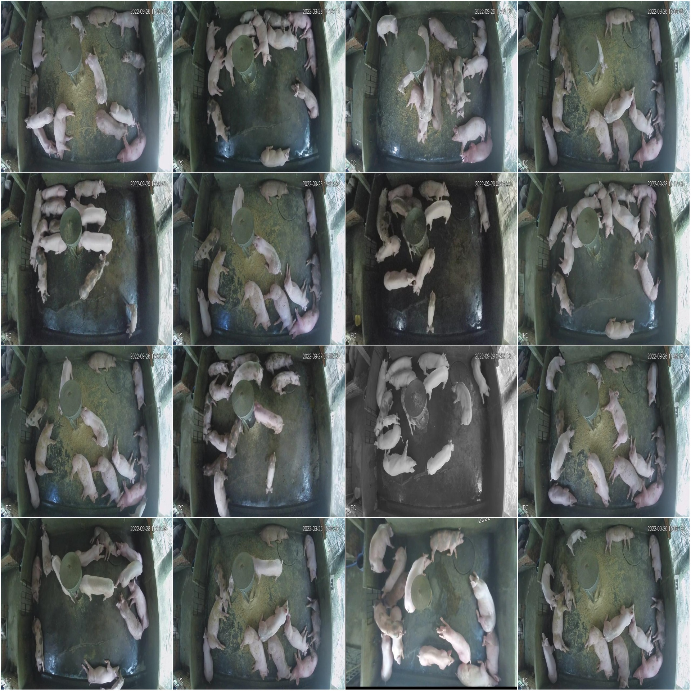
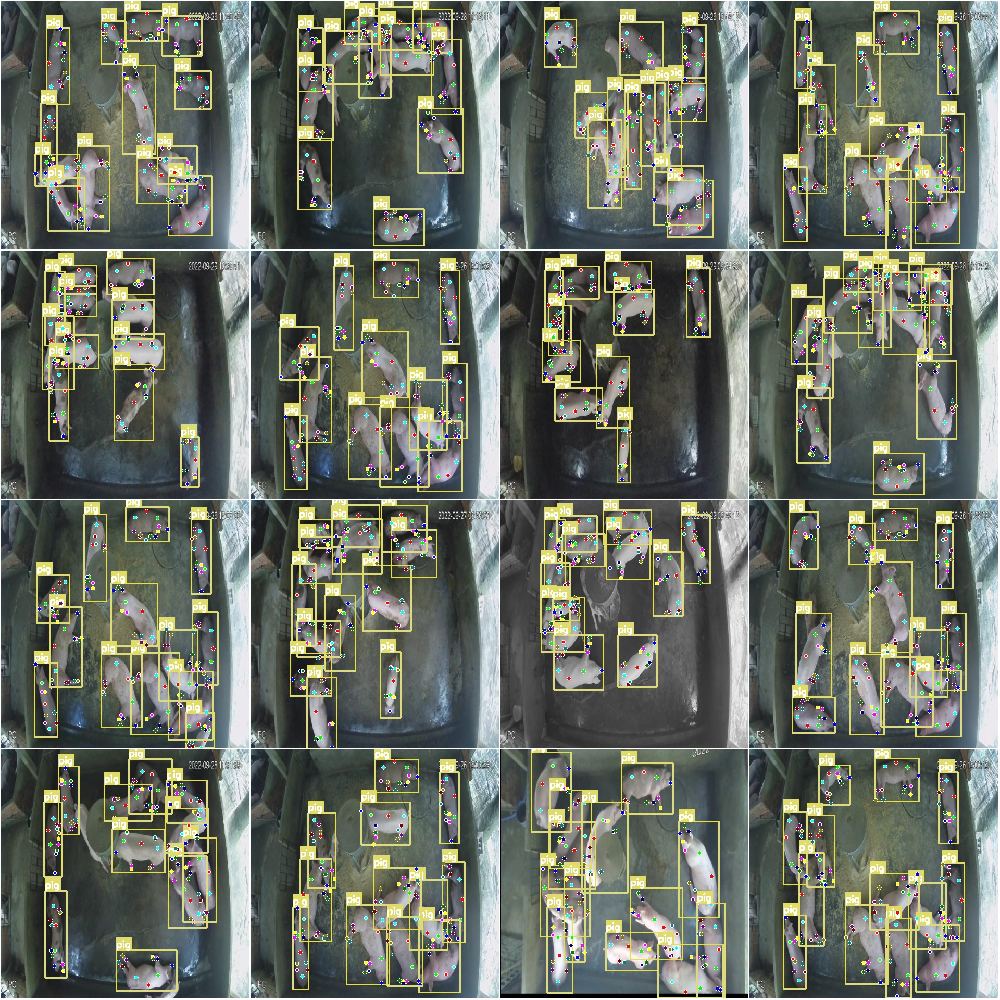

# Smart Poultry Farmyard Pose Estimation Keypoint Detection Dataset COCO+YOLO Format, 2874 Images, 1 Category and 12 Keypoints

Dataset format: YOLO keypoint format (Note that this is not the target detection or segmentation YOLO format, merely containing JPG images along with corresponding YOLO format TXT files) + COCO 
format.
Number of images (JPG file counts): 2874
Number of annotations (TXT file counts): 2874
Training set size: 2520
Validation set size: 296
Test set size: 58
Number of annotation categories: 1
Annotation category names: ['pig']
Number of keypoints: 12
Keypoints: ["1", "2", "3", "4", "5-Left", "6-Left", "7", "8", "9", "10", "11-Left", "12-Left"]
Each category annotated boxes count:
Pig boxes count=34829
Total boxes count=34829
Image resolution: 640x640
Important note: The dataset has been partitioned and can be directly used for training models like yolov5-pose, yolov8-pose, yolov11-pose, or yolov26-pose.
Special declaration: This dataset does not guarantee the accuracy of the trained model or weight files.
Image previews:
Annotation example:
Original images (randomly selected from 16):
Annotation drawing result:

## Images

Here is a pay link on Stripe ( https://buy.stripe.com/3cs8yP7sY87d0vu9AB ). Please contact me lonlonago@foxmail.com after funding $89, and I will send you a complete data files , thank you!

